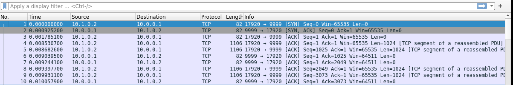
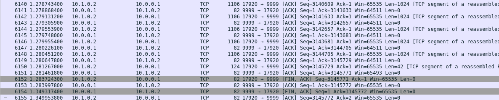
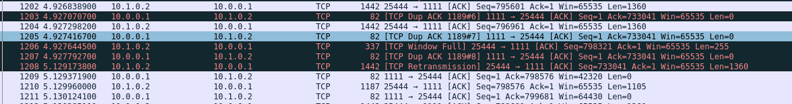
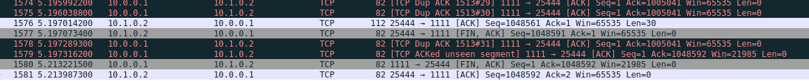
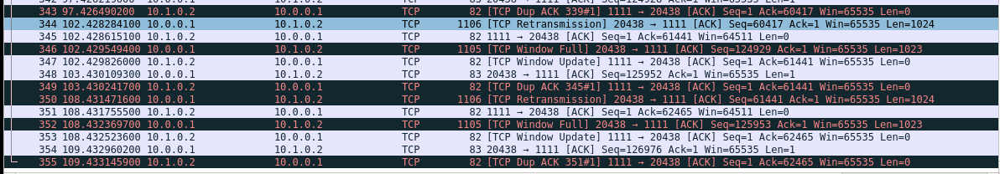
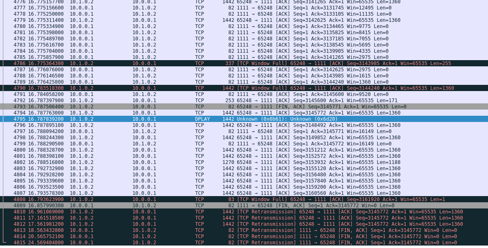

# TCP   

### Directory Structure

```
├── cmd                         -- source code for executables
│   ├── vhost
│   ├── vrouter
├── pkg
│   ├── proto
│   │   ├── ippacket.go
│   │   ├── tcppacket.go
│   │   ├── rip.go
│   ├── ipnode
│   │   ├── ipstack.go             -- shared structs & functions among routers & hosts
│   │   ├── ip_print.go
│   │   ├── ip_internal.go
│   │   ├── ip_repl.go
│   ├── tcpstack
│   │   ├── tcpstack.go         -- initialization & general APIs
│   │   ├── tcp_internal.go 	
│   │   ├── conn.go             -- normal socket related APIs & functions
│   │   ├── listener.go         -- listener socket related APIs & functions
│   │   ├── state.go            -- state machine
│   │   ├── state_internal.go 
│   │   ├── retransmission.go 
│   │   ├── sendbuf.go      
│   │   ├── recvbuf.go      
│   │   ├── priorityqueue.go 
│   │   ├── tcp_repl.go         
│   │   ├── tcp_print.go  
│   │   ├── utils.go  
│   ├── repl					-- common repl pkg
│   ├── vhost					-- vhost specific logics
│   ├── vrouter					-- vrouter specific logics
│   ├── lnxconfig               -- parser for .lnx file
├── util
│   ├── rip-dissector           -- for wireshark to decode messages in RIP protocols
│   ├── vnet_generate			-- generate .lnx from .json
│   ├── vnet_run				-- spawn tmux session
│   ├── gen_testfile.py			-- for generating files of certain size
└── reference                   -- reference programs
```


## Performance
Measure the time to send a file (roughly 3M) over non-lossy link

#### Reference
The reference always takes 1.3s



#### Our sender & receiver
Under ideal situation, it generally takes 0.8s (because we're sending more data in each segment than the reference). 


When there's zero window (when the receiver slows down), it takes much longer. The longest time observed was around 30s.
- seems to occur more frequently when testing `sf`, `rf` multiple times in a row


When testing our sender against reference receiver, or our receiver against reference sender:
- when no Zero Window occurred, it took 0.6~0.8s 
- when Zero Window occurred only once (with reference receiver), it took roughly 5s


## Packet Capture
**1 megabyte** file transmission between two of your nodes. To do this, run two of your nodes in the ABC network with the lossy node in the middle, configured with a **2%** drop rate.


#### Reference receiver & our sender
- One example segment sent and acknowledged

- One segment that is retransmitted

- Connection teardown



#### Reference sender & our receiver
Took too long to run... also frequently reached maximum transmissions and exited.

(After 100+ seconds, still asking for seg 62465 & transferring seg 126976. Not sure why.)


#### Our sender & receiver
Same as above.


## Notes
### Some Design Choice:
1. RFC 9293 seems to suggest each segment on the retransmission queue should have its own timeout. We're not sure how to implement that since we're only using one timer, and we're not updating the sent time of a segment due to retransmissions.

2. Currently send buffer / receive buffer related variables (SND.NXT, etc.) are implemented as atomics while also being protected by a general mutex `conn.mu`. The reason is "specifically when calculating usable send window, we want to ensure serializability between `reading SND.UNA & SND.WND` and `modifying SND.UNA & SND.WND`". It does feel a bit redundant.


## Other Known Bugs
When testing sending 3MB fileover non-lossy link:
1. `retransmission.go L37: meta.packet.TcpHeader.SeqNum+meta.length` sometimes reports nil pointer deref. Not sure why since all packet pushed onto the queue shouldn't be nil. Unable to consistently reproduce.

2. Sometimes `rf` hangs in `CLOSE_WAIT`. Probably got stuck in recvbuf.Read(). Not sure why.

3. Have absolutely no idea what this is all about. Seems very wrong starting from packet 4794. The received file was fine though.

