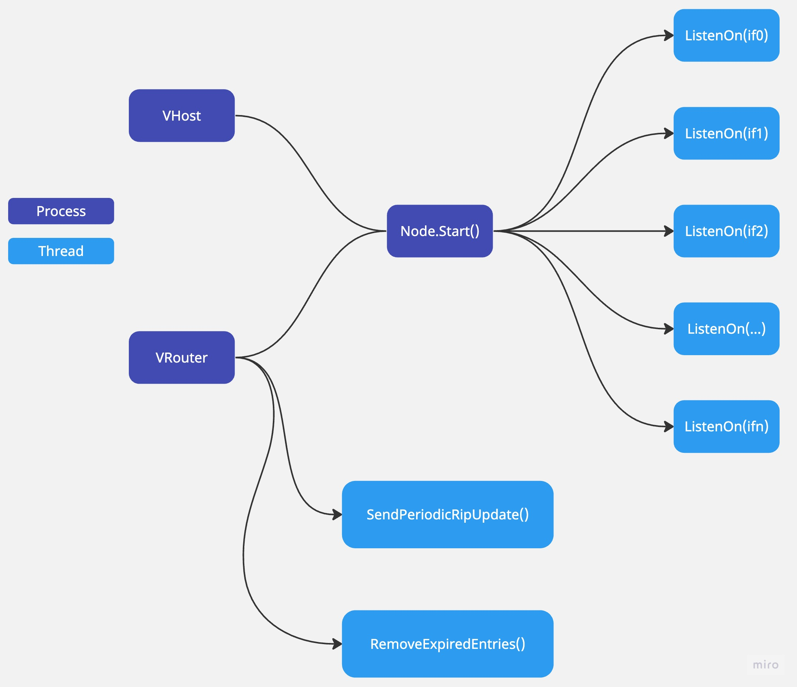

# README
<!-- 
- How you abstract your link layer and its interfaces
- The thread model for your RIP implementation
- The steps you will need to process IP packets
- You should also list any known bugs or notable design decisions in your README. If you identify known bugs and include a description of how you have attempted to fix the bug/where you think the bug originates from in your code, we will take off fewer points than if we have to find them ourselves.

- In your README, please also note whether you developed your work using the container environment or on the department machines, and any instructions necessary to build your project.
-->

Our code is in the refactoring phase under `refactoring` branch. 2.1 Directory Structure might change after the merge.

## 1. Build

The project is developed in the provided container environment.

`make all` will create a folder `exec` and build executables `vhost` and `vrouter` in the folder.

`make clean` will remove `vhost` and `vrouter` in the folder.

`util/vnet_run --bin-dir exec <directory with lnx files>` should start the network as expected.

## 2. Design

### 2.1 Directory Structure

```
├── cmd                         -- source code for executables
│   ├── vhost
│   ├── vrouter
├── pkg
│   ├── proto
│   │   ├── packet.go
│   │   ├── rip.go
│   ├── ipnode
│   │   ├── node.go             -- shared structs & functions among routers & hosts
│   │   ├── router.go           -- router specific functions
│   │   ├── host.go
│   ├── repl                    -- shared repl funcs among nodes
│   │   ├── repl.go
│   ├── lnxconfig               -- parser for .lnx file
│   │   ├── lnxconfig.go
│   ├── util                    -- shared functions among the module
│   │   ├── util.go
├── util
│   ├── rip-dissector           -- for wireshark to decode messages in RIP protocols
├── exec                        -- executables
│   ├── vhost
│   ├── vrouter
├── reference                   -- reference programs
├── net                         -- network topologies
├── README.md
└── Makefile

```

### 2.2 Abstraction & Design Details

#### 2.2.1 ipnode

Our network is representated as a graph of ip nodes. The ipnode package consists of three components: `node` as the top-level abstraction, `host` and `router` as differnent types of ip nodes.

- `Node` contains the basic information of a network node. 

    Since a host has one interface and a router might have multiple interfaces, we chose to use a map to store the interfaces' information as `Interfaces`. 

    Each interface has its own neighboring interfaces. We also want to include this kind of information in the `Node`. Therefore, we chose to use a map `ifNeighbors` for the purpose, where key is the interface's name and value is a list of `Neighbor` instances. The reason why we chose to design another struct `Neighbor` instead of directly using `Interface` is that we only want to know about the interface name, its ip and udp addresses during `send` procedures. The `IFName` will facilitate us in finding the `Interface` instance by looking at `node.Interfaces`.

    For `RoutingTable`, we also chose to use a map where key is the prefix and value is a routing entry that contains information about next hop, cost, and route type. 

    We also include a `ripNeighbors` list to store the rip neighbors of the router node. 

    ```Go
    type Node struct {
        Interfaces     map[string]*Interface          // interface name -> interface instance
        ifNeighbors    map[string][]*Neighbor         // interface name -> a list of neighbors on that interface
        RoutingTable   map[netip.Prefix]*RoutingEntry // aka forwarding table
        RoutingTableMu sync.RWMutex
        routingMode    lnxconfig.RoutingMode
        recvHandlers   map[uint8]RecvHandlerFunc
        // router specific info
        ripNeighbors []netip.Addr
    }
    ```

`node.go` also includes shared structs and functions among routers and hosts:

- `Interface` as the interface of each node. Each `interface.conn` is a type of `UDPConn` which represents the link layer in this project.

    ```Go
    type Interface struct {
        Name           string
        AssignedIP     netip.Addr
        AssignedPrefix netip.Prefix
        UDPAddr        netip.AddrPort
        isDown         bool
        conn           *net.UDPConn
    }
    ```

- `Neighbor` as the neighbor (simplified) interface of each interface.

    ```Go
    type Neighbor struct {
        VIP     netip.Addr
        UDPAddr netip.AddrPort
        IFName  string
    }
    ```

- `RoutingEntry` as the entry of the node's routing table:

    ```Go
    type RoutingEntry struct {
        RouteType    RouteType
        NextHop      netip.Addr
        LocalNextHop string     // interface name. "" if not local
        Cost         int16
    }   
    ```

#### 2.2.2 proto

proto package is composed of `packet` and `rip`. 

- `Packet` represents a packet in the computer networks:

    ```GO
    type Packet struct {
        Header  *ipv4header.IPv4Header
        Payload []byte
    }
    ```

- `RipMsg` is a type of message that encompasses routing related information.

    ```Go
    type RipMsg struct {
        Command    RoutingCmdType
        NumEntries uint16 // <= 64 (and must be 0 for a request command)
        Entries    []*RipEntry
    }

    type RipEntry struct {
        Cost    uint32 // <= 16. we define INFINITY to be 16
        Address uint32 // IP addr
        Mask    uint32 // subnet mask
    }

    type RoutingCmdType uint16

    const (
        RoutingCmdTypeRequest  RoutingCmdType = 1 // for request of routing info
        RoutingCmdTypeResponse RoutingCmdType = 2
    )
    ```

### 2.3 Thread Model

When a node starts, it will spawn several threads to listen on each interface. For a router, it will spawn two additional threads: one to send periodic rip updates to the neighbors; one to remove any expired routing entries.



### 2.4 Steps to Process IP Packets

#### 2.4.1 Send

There is no difference in sending test or rip messages since both of them are wrapped into packets. The node only needs to figure out what the next hop is and which interface is responsible for forwarding the packet.

**Send func definition:**

```Go
func (n *Node) Send(destIP netip.Addr, msg []byte, protoNum uint8) error
```

**Send Logic Flow:**

> **Input**: A destination IP destIP, a message byte slice msg, a protocol number protoNum indicating which protocol to use  
  **Output**: error if presents  
  **Procedures**:  
    1&ensp;   if protoNum is neither test nor packet then  
    2 &ensp; &ensp;  return error  
    3&ensp;  End if  
    *Finds the source interface to send out the packet and the dest UDP remote addr to receive the packet using the longest prefix matched method*  
    4 &ensp; srcIF, remoteAddr, error -> FindLinkLayerSrcDst(destIP)   
    5 &ensp; if cannot find the the interface or the dest UDP remote addr then  
    6 &ensp; &ensp;   return error  
    7 &ensp; End if  
    *Creates a new packet with message as the payload, assigend IP of the source interface as the src, remoteAddr as dst, protoNum as protocol*  
    8 &ensp; packet -> NewPacket(srcIF.AssignedIP, destIP, msg, protoNum)  
    *Forwards the packet*  
    9 &ensp; error -> ForwardPacket(srcIF, remoteAddr, packet)  
    10 &ensp; if cannot forward  
    11 &ensp; &ensp; return error  
    12 &ensp; End if  

**Helper funcs**:

```Go
// Finds the source interface and the dest UDP remote addr of the next hop
func (n *Node) FindLinkLayerSrcDst(destIP netip.Addr) (*Interface, netip.AddrPort, error) 

// Forwards the packet from source interface to the destination
func (n *Node) ForwardPacket(srcIF *Interface, dst netip.AddrPort, packet *proto.Packet) error 

// Finds the routing entry of next hop and previous step according to the destIP
func (n *Node) findNextHopEntry(destIP netip.Addr) (entry *RoutingEntry, altAddr netip.Addr)  

// Finds the longest prefix matched prefix in the routing table for the destIP
func (n *Node) findLongestMatchedPrefix(destIP netip.Addr) netip.Prefix

// Finds the neighbor interface of the interface with ifName, given the next hop IP which should match neighbor's virtual IP
func (n *Node) findNextHopNeighbor(ifName string, nexthopIP netip.Addr) *Neighbor
```

#### 2.4.2 Receive

For receiving packets, we have a handler type defined as `type RecvHandlerFunc func(*proto.Packet, *Node)`.

**Receive func definition:**

For *hosts*, we have a test packet handler `func testRecvHandler(packet *proto.Packet, node *ipnode.Node)` which simply prints out the information of the packet.

For *routers*, we have two handlers, one for test and one for rip.

- Test: `func routerTestRecvHandler(packet *proto.Packet, node *ipnode.Node)`

    **Test Logic Flow:**

    > **Input**: A received packet, a node that handles the logic   
    **Procedures**:   
    1 &ensp; **if** the packet is for one of the interfaces in this node  
    2 &ensp; &ensp; prints out the information of the packet  
    3 &ensp; &ensp; **return**  
    4 &ensp; **End if**  
    *Finds the source interface to send out the packet and the dest UDP remote addr to receive the packet using the longest prefix matched method*  
    5 &ensp; destIP -> packet.Header.Dst  
    6 &ensp; srcIF, remoteAddr -> FindLinkLayerSrcDst(destIP)   
    7 &ensp; ForwardPacket(srcIF, remoteAddr, packet)  

- RIP: `func ripRecvHandler(router *VRouter) func(*proto.Packet, *ipnode.Node)` returns another func that takes in `*proto.Packet, *ipnode.Node` as args. The pseudocode presnets the logic of the later func.

    **RIP Logic Flow:**
    > **Input**: A received packet, a node that handles the logic   
    **Procedures**:  
    1 &ensp; ripMsg -> Unmarshals the packet  
    2 &ensp; **switch** ripMsg.Command **do**  
    3 &ensp; &ensp; **case** Request:  
    4 &ensp; &ensp; &ensp; **if** number of entries is not 0   
    5 &ensp; &ensp; &ensp; &ensp; **return**  
    6 &ensp; &ensp; &ensp; **End if**  
    7 &ensp; &ensp; &ensp; Converts routing entries to RIP entries  
    8 &ensp; &ensp; &ensp; Creates RIP response payload  
    9 &ensp; &ensp; &ensp; Sends out the payload   
    10 &ensp; &ensp; **case** Response:  
    11 &ensp; &ensp; &ensp;  Converts RIP entries to Routing entries  
    12 &ensp; &ensp; &ensp; Updates node's Routing Table  
    13 &ensp; &ensp;**default**:  
    14 &ensp; &ensp; &ensp; do nothing

**Helper funcs**:

```Go
// Creates and marshals rip response to dest
func createRipResponse(entries []*ipnode.RoutingEntry, dest netip.Addr) ([]byte, error)

// Converts RIP entries to Routing entries  
func ripEntriesToRoutingEntries(entries []*proto.RipEntry, proposer netip.Addr) []*ipnode.RoutingEntry

// Converts Routing entries entries to RIP entries
func routingEntriesToRipEntries(entries []*ipnode.RoutingEntry, dest netip.Addr) []*proto.RipEntry

// Updates routing table using distance vector routing along with split horizon and poison reverse
func (r *VRouter) updateRoutingTable(entries []*ipnode.RoutingEntry)

// Gets all local & remote entries in the routing table
func (r *VRouter) getAllEntries() []*ipnode.RoutingEntry
```

## 3. Known Bugs

To the best our knowledge, there's no existing bugs in our code yet.


## 4. Refactoring note
Changes:
1. Sort vrouter and vhost specific logic into separate packages.
2. Decouple REPL & ipnode
3. Put utils into separate packages

Planned(?):
4. Should different protocols live in different packages?