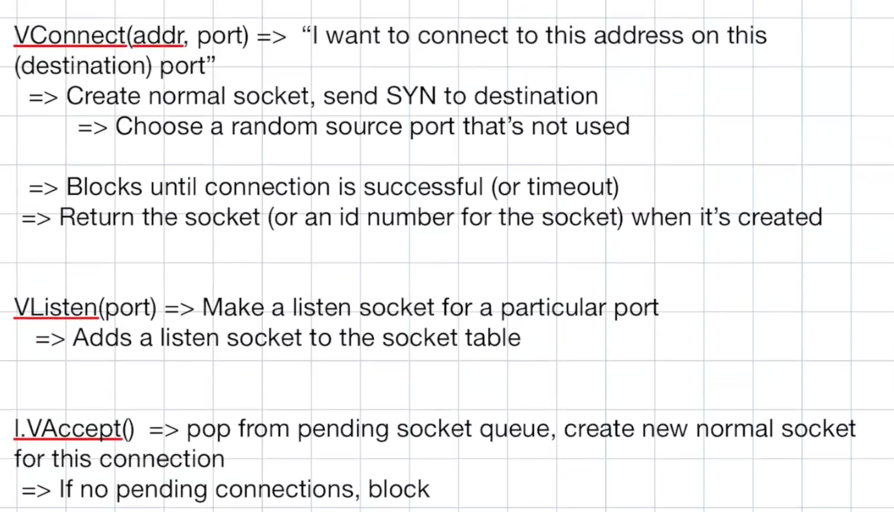

# TCP_Milstone

## Milestone I

- Establishing new connections by properly following the TCP state diagram under ideal conditions. Connection teardown is NOT required for this milestone.

- When creating new connections, you should allocate a data structure pertaining to the socket—be prepared to discuss what you need to include in this data structure for the rest of your implementation

- To test establishing new connections, you should implement the a, c, and (partially) ls commands in your TCP driver to listen for, create, and list connections, respectively. For the ls command, you need not list the window sizes for the milestone.

- You should be able to view your TCP traffic in Wireshark to confirm you are using the packet header correctly. However, you do not need to compute the TCP checksum yet.

- In addition, try to consider how you will tackle these problems, which we will discuss:
  - What does a SYN packet or a FIN packet do to the receiving socket (in general)?

    The status/state of the receiving socket might change accordingly.

  - What data structures/state variables would you need to represent each TCP socket?

    Specified in design below.

  - How will you map incoming packets to sockets?

     SrcIp/RemoteAddr is from IPHeader. RemotePort is included in TCP Packet. Local Addr and Local Port are in the Listener. These four fields together form a tuple repersenting a key entry in the socket table. Thus, we could use this to map incoming packet to the socket.

  - What types of events do you need to consider that would affect each socket?

    Three-way handshake. Closure of the socket. (there should be more about retransmission?)

  - How will you implement retransmissions?

     Not sure yet.

  - In what circumstances would a socket allocation be deleted? What could be hindering when doing so? Note that the state CLOSED would not be equivalent as being deleted.

    Not sure yet.

## Milestone II

For this meeting, students should have the send and receive commands working over non-lossy links. That is, send and receive should each be utilizing the sliding window and ACKing the data received to progress the window. To do this, you should have a working implementation for your send and receive buffers, including handling sequence numbers, circular buffers, etc.

Retransmission, connection teardown, packet logging and handling out-of-order packets is not required yet.


## Directory Structure

```
├── cmd                         -- source code for executables
│   ├── vhost
│   ├── vrouter
├── pkg
│   ├── proto
│   │   ├── ippacket.go
│   │   ├── tcppacket.go
│   │   ├── rip.go
│   │   ├── srtt.go
│   │   ├── cirbuff.go
│   ├── ipnode
│   │   ├── node.go             -- shared structs & functions among routers & hosts
│   │   ├── node_print.go
│   │   ├── node_subr.go
│   │   ├── ip_repl.go
│   ├── tcpstack
│   │   ├── tcpstack.go         -- shared structs & functions for tcpstack
│   │   ├── conn.go             -- normal socket related functions
│   │   ├── listener.go         -- listener socket related functions
│   │   ├── state.go            -- state machine
│   │   ├── tcb.go              -- tcb info
│   ├── repl
│   │   ├── repl.go
│   ├── vhost
│   │   ├── vhost.go
│   ├── vrouter
│   │   ├── vrouter.go
│   ├── lnxconfig               -- parser for .lnx file
├── util
│   ├── rip-dissector           -- for wireshark to decode messages in RIP protocols
├── reference                   -- reference programs
├── net                         -- network topologies
└── Makefile
```

## Functionality

- Connection setup and state management (ie, implementing the TCP state machine)
- Building and sending TCP packets
- The sliding window protocol, which governs how to send and receive data
- Retransmissions for segments that time out, governed by an estimate for the round-trip-time to the destination (SRTT)
- Connection termination
- Properly follow the state diagram.
- Adhere to the flow control window.
- Re-transmit based on a computed RTO interval (based on SRTT)
- Send data reliably–files sent across your network should arrive at the other end identical to how they were sent, even if the links in between the two nodes are lossy.

[Edge cases](https://brown-csci1680.github.io/iptcp-docs/specs/tcp-notes/#handling-edge-cases) see here.

## Performance

After filtering your packet capture to show only one side of the transmission, you should “annotate” the following items in the capture file:

- The 3-way handshake
- One example segment sent and acknowledged
- One segment that is retransmitted
- Connection teardown

## Design

### TCP Commands (hosts)

- **Basic commands** are small wrappers around Socket API functions so that we can test them. These commands don’t do much more than call their respective API function:
  - `a`: Listen and accept on a port (like a “server”) **(milestone I)**
  - `c`: Connect to a socket (like a “client”) **(milestone I)**
  - `s`: Send data using a socket
  - `r`: Receive data on a socket
  - `cl`: Close a socket
- **Other commands** are a bit more involved:
  - `ls`: List all sockets **(milestone I)**
  - `sf`: Use your Socket API to send a file
  - `rf`: Use your Socket API to receive a file

<!-- ### pkg: ipnode

#### node.go

Add another handler for tcp packet:

On receiving packet with “SYN”, find corresponding airport in the socket table, push this connection into its queue (channel) for VAccept to consume -->

### cmd

#### vhost.go

Add tcp support.

### pkg: vhost

#### vhost.go

```Go
func (v *VHost) GetLocalAddr() netip.Addr
func (h *VHost) SendTcpPacket(p *proto.TCPPacket, srcIP netip.Addr, destIP netip.Addr) error 
```

### pkg: tcpstack

VListen creates a new listening socket bound to the specified port. After binding, this socket moves into the LISTEN state—this is known as “passive open” in the RFC.

VListen returns a TCPListener on success. On failure, it should return an error describing the failure.

```Go
// Inits tcp stack state
func Init(addr netip.Addr, host *vhost.VHost) 
func VListen(port uint16) (*VTCPListener, error)
//similar to Dial
func VConnect(addr netip.Addr, port int16) (VTCPConn, error)
```

#### globalInfo.go

```Go
type TCPEndpointID struct{
    localAddr  netip.Addr
	localPort  uint16
	remoteAddr netip.Addr
    remotePort uint16
}

type VTCPGlobalInfo struct{
    LocalAddr     netip.Addr //NEWLY ADDED. 
	ListenerTable map[uint16]*VTCPListener //port num: listener
	ConnTable     map[TCPEndpointID]*VTCPConn
	TableMu       sync.RWMutex
	Driver        *vhost.VHost //NEWLY ADDED. 
}

func (*VTCPGlobalInfo) GetRandomPortNum() // get an available (unused) port num
```

#### vtcpListener.go
VAccept waits for new TCP connections on the given listening socket. If no new clients have connected, this function MUST block until a new connection occurs.

When a new client connects, VAccept returns a new normal-type socket to represent the new connection. In our example, it returns a new VTCPConn struct for this socket.

On failure, this method should return nil for the socket and a non-nil error value describing the failure.

```Go
type VTCPListener struct {
	addr          netip.Addr
	port          uint16
	pendingSocket chan struct {
		*proto.TCPPacket
		netip.Addr
	} //NEWLY ADDED. since we need info about TCP header and the srcIP
}

func (*VTCPListener) VAccept() (*VTCPConn, error)
func (*VTCPListener) VClose() error	// not for milestone I
```

```Go
type VTCPConn struct{ //represents a TCP socket
    socketId           uint32
    localAddr  netip.Addr
	localPort  uint16
	remoteAddr netip.Addr
	remotePort uint16

	sendBuff *proto.CircBuff
	recvBuff *proto.CircBuff

    state           State
    stateMu         sync.Mutex

    srtt             *proto.SRTT
	localInitSeqNum  uint32 //should be atomic.
	remoteInitSeqNum uint32 // NEWLY ADDED.
	largestAckedNum  uint32 //should be atomic. the largest ACK we received
	expectedSeqNum   uint32 //should be atomic. the ACK num we should send to the other side

	windowSize uint32

	recvChan chan *proto.TCPPacket //NEWLY ADDED. see details of VRead in the handout.
}

func (*VTCPConn) VRead(buf []byte) (int, error) // not for milestone I
func (*VTCPConn) VWrite(data []byte) (int, error) // not for milestone I
func (*VTCPConn) VClose() error // not for milestone I
func (*VTCPConn) generateStartSeqNum()
```

##### API



#### state.go

```Go
type State string

const (
    CLOSED       State  = "CLOSED"
    LISTEN       State  = "LISTEN"
    SYN_RECEIVED State  = "SYN_RECEIVED"
    SYN_SENT     State  = "SYN_SENT"
    CLOSING      State  = "CLOSING"
    FIN_WAIT_1   State  = "FIN_WAIT_1"
    FIN_WAIT_2   State  = "FIN_WAIT_2"
    TIME_WAIT    State  = "TIME_WAIT"
    CLOSE_WAIT   State  = "CLOSE_WAIT"
    LAST_ACK     State  = "LAST_ACK"
    ESTABLISHED  State  = "ESTABLISHED"
)
```

State machine see example [here](https://github.com/google/netstack/blob/55fcc16cd0eb096d8418f7bc5162483c31a4e82b/tcpip/transport/tcp/connect.go#L288).

### pkg: proto

#### circBuff.go

```Go
type CircBuff struct{
    buff        []byte
    capacity    uint32
    size        uint32
    head        uint32
    tail        uint32
    lock        sync.Mutex
    segments
    //...TBD
}
```

#### tcp.go

The maximum TCP payload size is:
`1400 bytes - (size of IP header) - (size of TCP header)`

```Go
import "github.com/google/netstack/tcpip/header"

const (
	TcpHeaderLen         = header.TCPMinimumSize
	TcpPseudoHeaderLen   = 12
	ProtoNumTCP          = header.TCPProtocolNumber
	MaxVirtualPacketSize = 1400
)

type TCPPacket struct {
	TcpHeader *header.TCPFields
	Payload   []byte
}
```

#### srtt.go

See [RFC6298](https://datatracker.ietf.org/doc/html/rfc6298) for the algorithm, and [RFC9293](https://datatracker.ietf.org/doc/html/rfc9293#name-retransmission-timeout).

```Go
type SRTT struct{
    alpha   float64
    beta    float64
    minRTO  float64
    maxRTO  float64
    srtt    float64
    //...TBD
}

type Transmission struct{
    //...TBD
}
```


