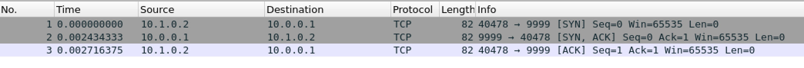

# TCP Testing

## Handshake under ideal conditions [ALL PASS]

1. Listen on a non-existing port: `a 9999`
2. Listen on an existing port should error: `a 9999`
3. Connect to an open port should create sockets on both sender and receiver: `c 10.0.0.1 9999`
4. Connect to a non-existing port should error: `c 10.0.0.1 8888`
5. Successful handshake

## Send and Recv CLI over non-lossy links

## Retransmission

## Connection teardown

## Out-of-order packets
