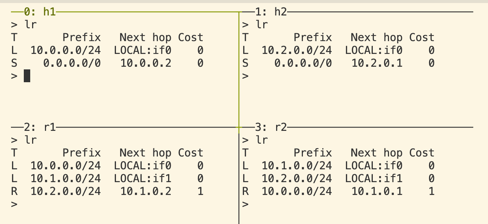
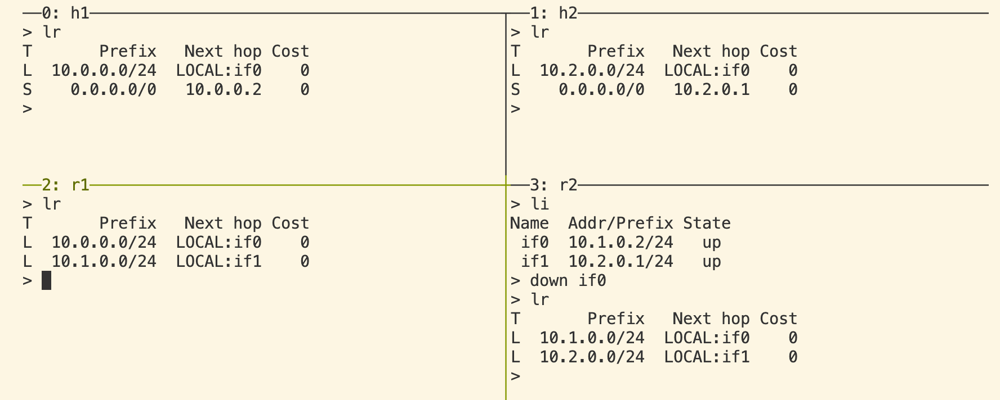
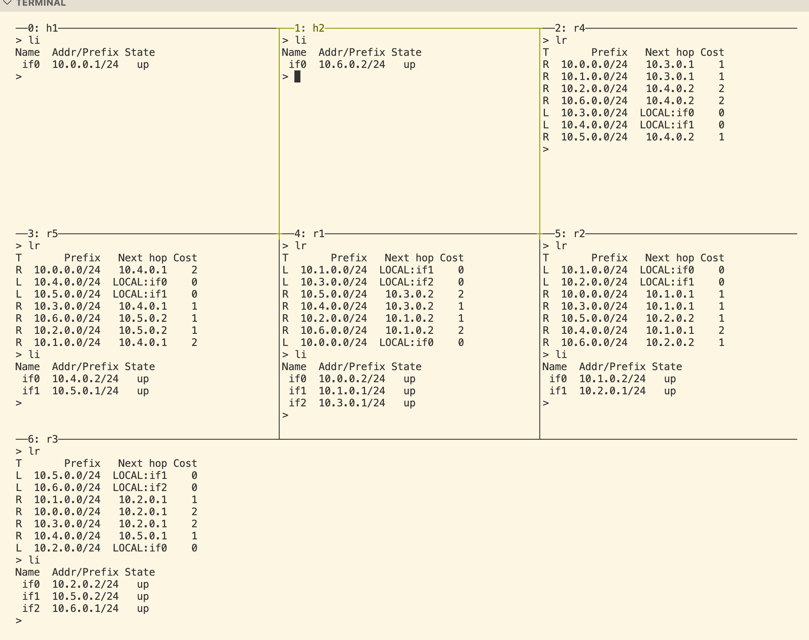
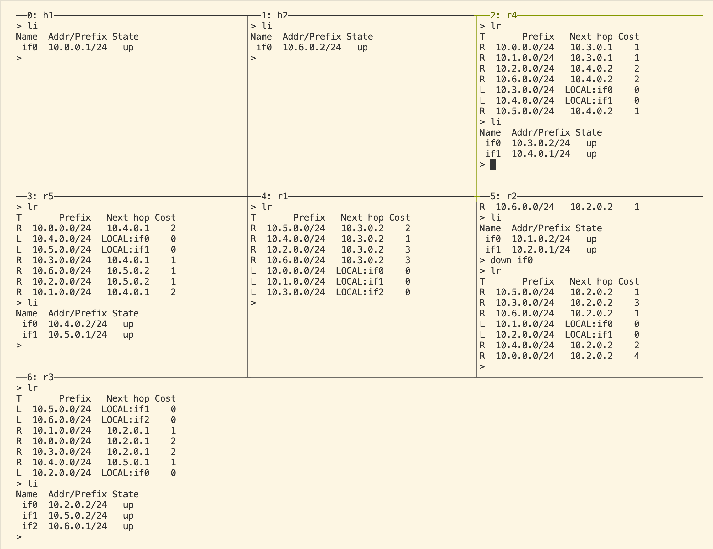

# Testing

## Test packet [ALL PASS]

1. Send the packet to the neighbors: TTL should be 31;
2. Send the packet to other available nodes: TTL should decrement according to the number of links it passed;
3. Send the packet to the node itself: TTL should be 31;
4. Host sends the packet to a non-existing ip: should only print the sent message;
5. Router sends the packet to a non-existing ip: should errors no such a node with this ip exists;
6. If an interface is down/up, should update the interfaces map `li` accordingly;
7. `ln`, `lr` should be able to print the correct information.

## RIP packet [IN PHASE]

1. Should have all of the test packet capabilities;
2. **[PASS]** Should be able to update `R` routing entry at the beginning immediately;

    ours is a bit slower, but the logic is correct

    > r2h2 reference\
    

3. **[PASS]** If an interface is down, the neighbors should delete the corresponding RIP routing entry if no other routes avaiable;
    > r2h2 reference: if0 of r2 is down\
    

4. **[TESTING]** For each `R` routing entry, it should always has the lowest-cost path:
     > loop reference\
    

5. **[TESTING]**  If an interface is down, the neighbors should update the routing table if there are other available routes:
    > loop reference: if0 of r2 is down\
    

## RIP debug changelog

10.15 Fix nil pointer issue in RipMsg.UnMarshal

10.15 Fix updateRoutingTable: skip any updates for local or static routes; costs should choose the minimum value.
